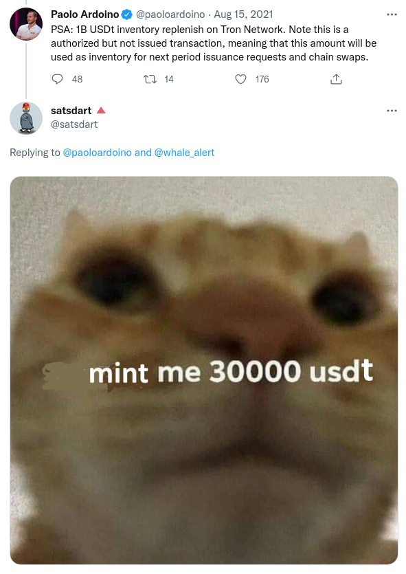

# Token faucet
> A token factory to spawn free testnet tokens

Features:
- Same address on all chains (it's deterministic and anyone can deploy it)
- Minting is limited so nobody can grief by minting a lot of tokens and cause overflows
- Gives creator the ability to mint as much as they want and change the mint limit

## Why
Every protocol that deploys on testnet needs tokens to test, and currently what's happening is that everyone is rolling their own mock tokens.

This project is our attempt at simplifying testnet development by creating a simple token factory that anyone can use to spin their own tokens.

There's been some projects that built generic tokens in the past, but their main issues is that they only deployed a single token and they were griefable by anyone that minted tokens up to the uint256 limit, which would make further mints break due to overflow. This project enforces a limit to each mint so you can share the contracts with testers and don't have to worry about anyone griefing them.

## Usecase example


----

## Development

### Contracts
Anyone can deploy these to any EVM network (at the same address!), so feel free to deploy them everywhere
```shell
npm test
npx hardhat coverage
npx hardhat --network rinkeby deploy
npx hardhat --network rinkeby etherscan-verify
npx hardhat verify --network rinkeby DEPLOYED_CONTRACT_ADDRESS
```

### Frontend
```shell
yarn # install packages
yarn dev # run local server for development
```
